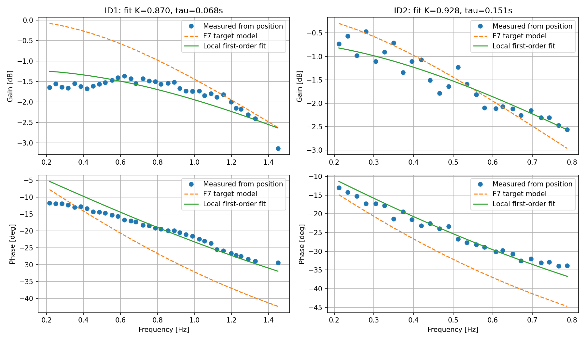

# 角度振幅一定チャープ：初回測定結果

2026-09-09、肘のネジ締結後に実施。F7 Mode4の電流出力DOB、単軸ずつ、非試験軸は開始位置をPP保持。
両試験とも正常終了し、最後はRobstride両軸Disable。RoboMasterは校正・Enableとも無効のまま。
最速モデルの確定や全姿勢での保証はまだ行っていない。

## 条件と結果

| 項目 | ID1 肘 | ID2 根本 |
| --- | --- | --- |
| モーター | EL05 | RS02 |
| 開始位置（肘,根本） | -80.861°,112.493° | -83.178°,112.510° |
| チャープ | 0.2→1.5Hz | 0.2→0.8Hz |
| 角度設計振幅 | ±5°（往復10°） | ±5°（往復10°） |
| 時間 | 本体60秒+前後各5秒 | 同左 |
| F7目標モデル時定数 | 0.1秒 | 0.2秒 |
| 速度Kp / Ki / DOB帯域 | 20 / 1 / 3rad/s | 12 / 1 / 3rad/s |
| J / d / Kt | 0.121497 / 0.02 / 0.94 | 0.607 / 0.02 / 1.22 |
| 電流指令上限 | 5A | 段階確認3A |
| RAM記録上の電流指令ピーク | 5.000A | 1.618A |
| 有効周期の実測往復幅（基本波フィット） | 8.385～10.029° | 9.403～10.482° |
| 評価周期 / 有効周期 | 38 / 35 | 26 / 26 |
| 位置由来速度/目標モデルの振幅比中央値 | 0.939 | 0.995 |
| 上記振幅比の範囲 | 0.835～1.002 | 0.938～1.049 |
| 上記位相差の範囲 | -3.99～+12.92° | +1.87～+10.88° |
| 試験中の実測角度範囲 | -87.679～-76.627° | 105.500～117.761° |
| 最後の位置 | -83.178° | 110.965° |

速度目標は角度軌道の微分vと加速度aからu=v+tau*aとして生成。一定速度振幅ではない。
非試験軸の通常PP速度上限は15°/sのまま。DOBの速度入力上限のみ180°/sに変更した。
初回波形の逆モデル入力ピークは机上で肘64.76°/s、根本35.58°/sであり、この入力上限には当たらない。
標準速度FBのF7内LPFは40ms。位置由来速度の基本波も評価し、LPF後の速度が合うだけで実機が同一モデルと断定しない。

## 飽和・通信

肘では1.342、1.389、1.428Hzの3周期がRAMサンプル中5%以上の電流指令飽和に該当し、同定から除外した。
肘の全RAMサンプル中の飽和率は約0.222%、根本は0%。これは50Hzログで観測した割合であり、500Hz全制御周期の正確な飽和率ではない。
肘で2Hzへの拡張はまだ実施していない。根本も1Hz/5Aへの拡張は未実施。
参考電流はType2トルク/KtによるArms相当で、実測iqfでもF7電流指令そのものでもない。

両試験それぞれの完全な稼働1秒窓71個すべてで、試験軸の目標送信受付500回/s、Type2受信500回/s、
ループ500回/s、最大ループ間隔2msを確認。送信キューあふれ・優先キュー満杯・送信/CANエラーはいずれも0。
F7制御500Hz、ROS FB100Hz、RAM記録50Hz。DOB中の電流追加CAN読み出しはなし。

## 局所一次遅れ近似（設定への自動反映なし）

有効周期の位置基本波から速度を求め、指令速度→実機速度の複素周波数応答を一次遅れK/(1+tau*s)に近似した。

- ID1: `0.8698 / (1 + 0.06838*s)`。測定域0.216～1.450Hz（上記除外周期を除く）。平均複素相対フィット誤差4.34%、最大12.36%。
- ID2: `0.9278 / (1 + 0.15056*s)`。測定域0.212～0.788Hz。平均複素相対フィット誤差3.12%、最大6.77%。

この誤差は近似モデルの測定値へのフィット誤差であり、元の目標モデルへの追従誤差ではない。
Kは未測定のDC域で保証されたゲインではない。時定数も最速達成可能値ではない。
逆モデルで同じ角度軌道を与える試験だけで、tauを短くした際の任意速度ステップへの追従限界まで証明することはできない。
摩擦・バックラッシュ・姿勢依存と、速度LPFによる位相差・中心位置のドリフトが残る。
MPCに投入する全域モデルには、この測定域外への検証が別途必要。



## 生データ・グラフ

- [肘：角度/速度/電流/往復幅](../arm_step_20260909_194217/angle_chirp.png)
- [根本：角度/速度/電流/往復幅](../arm_step_20260909_194429/angle_chirp.png)
- 肘データ: `../arm_step_20260909_194217/`
- 根本データ: `../arm_step_20260909_194429/`
- 各フォルダ: `metadata.json`（条件/ソース/ELF hash）、`feedback.csv`、`dob.bin`、`dob.csv`、`angle_cycles.csv`、`angle_summary.json`、`rate/`。
- このフォルダ: `identified_models.json`、`identified_models.png`、`chirp_design.md`。

両試験のELF SHA256: `a5c3b2edda43c2616ef464fc43bb7b1d88fdfd369a5764186a1c0e754e925ad6`。
Debug/Releaseビルド、書き込みVerify、波形微分・離散モデル追従テスト、速度推定ホストテスト、Python構文、diffチェック成功。
試験後にarm_test_config.hの説明コメントだけ更新した（実行ロジックは不変）。Git commit/pushはしていない。

## 再現コマンド

実行前に単独の指令publisher、初期角度範囲、両軸Disable、現在のFWパラメーターとmodel-tauの一致を確認する。

```bash
source /opt/ros/humble/setup.bash
source ../catch26_interface/install/local_setup.bash
ROS_DOMAIN_ID=30 PYTHONNOUSERSITE=1 python3 tools/arm_small_step.py --move --velocity-motor 1 --dob --angle-chirp --frequency-start .2 --frequency-end 1.5 --model-tau .1 --current-monitor-limit 5 --tag angle5_id1_tau100_5A
ROS_DOMAIN_ID=30 PYTHONNOUSERSITE=1 python3 tools/arm_small_step.py --move --velocity-motor 2 --dob --angle-chirp --frequency-start .2 --frequency-end .8 --model-tau .2 --current-monitor-limit 5 --tag angle5_id2_tau200_3A
```

一つの測定が終わって解析・確認してから次を実行する。RAMは各測定後にtools/read_arm_dob.pyで読み出す。
