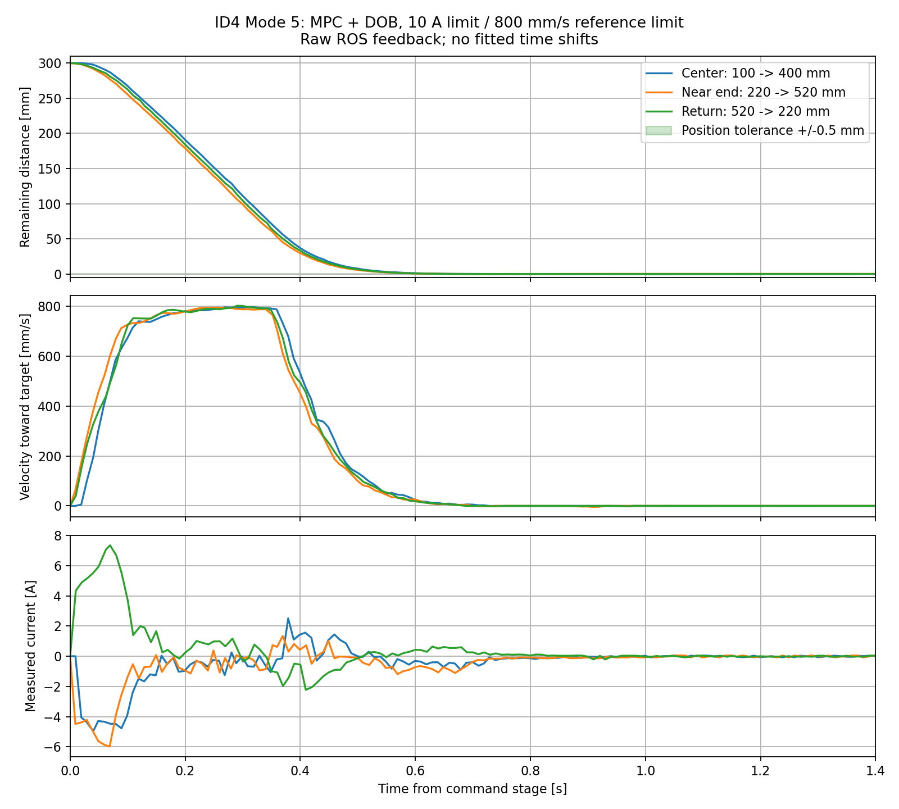

# ID4 Mode5 MPC位置制御：2026-09-09実機調整

## 追記：無負荷仕様に合わせ825mm/sへ変更（現行設定）

公式M2006仕様: 出力軸無負荷500rpm、定格24V。
https://www.robomaster.com/en-US/products/components/general/M2006
ID4は99mm/出力軸回転なので、500×99/60=825mm/s。
Mode5上限をこの式で設定し、後段のMode4用800mm/sクリップをMode5に適用しない
よう分離した。Mode4の従来上限は変更していない。電流10A、校正2Aは維持。

825mm/s初回の端付近試験は旧0.08秒非常判定で約486mmに途中停止した。
実測停止距離36.84mm/約769mm/s（約0.048秒相当）とモデルtau0.05秒に対し、
0.065秒の余裕付き判定へ変更。非常減速を通常PIから同じDOBの速度ゼロに変更し、
高速ゲイン切替による減速中の微小往復を避ける。通常速度包絡0.10秒と
ハード停止526.878mmは維持。変更後に端付近往復を再試験した。

| 移動 | 位置±0.5mm継続整定 | かつ速度±2mm/s継続整定 | 最終1秒の最大位置誤差 | 実測最高速度 |
|---|---:|---:|---:|---:|
| 約100→400mm | 0.620s | 0.679s | 0.110mm | 803.69mm/s |
| 約220→520mm | 0.628s | 1.168s | 0.267mm | 803.32mm/s |
| 約520→220mm | 0.607s | 0.688s | 0.023mm | 824.27mm/s |

中央試験は825mm/s化直後、端/戻り試験は非常減速変更後。いずれも正常到達。
端側は位置追従こそ同等だが、生速度FBの厳密な静止判定は中央より長い。
無負荷仕様値は、実負荷で常に達成できる速度保証ではない。
通常動作での途中停止解消は確認したが、新非常減速の故意の発動試験は未実施。

- id4_mpc_20260909_162807: 825mm/s、0→100
- id4_mpc_20260909_162816: 825mm/s、中央300mm比較
- id4_mpc_20260909_162845: 400→220
- id4_mpc_20260909_162856: 旧非常判定で520目標未到達（失敗）
- id4_mpc_20260909_163053: 非常減速変更後、0→220
- id4_mpc_20260909_163102: 825mm/s、端付近300mm比較
- id4_mpc_20260909_163123: 825mm/s、戻り300mm比較

以下は800mm/sまでの調整履歴。現行パラメータは本追記を優先する。

## 結果

F7 `ohmori/control_dev` にMode5を実装し、実機へ検証付き書き込み済み。
対象はC610/M2006のRoboMaster ID4のみ。ID1は動かさず、校正もID4のみ。
2A/150mm/s → 4A/300mm/s → 6A/600mm/s → 10A/800mm/sの段階試験を行った。
最終採用は10A/800mm/s。全条件の大域的な最短時間ではなく、今回試した設定中の
位置整定時間が最短のもの。負荷変更、温度上昇、長時間連続運転は未検証。

### 最終設定の300mm移動比較

| 移動 | ±0.5mmへの継続整定 | かつ速度±2mm/sへの継続整定 | 最終1秒の最大位置誤差 | 実測最高速度 |
|---|---:|---:|---:|---:|
| 約100→400mm（中央） | 0.629s | 0.729s | 0.066mm | 795.94mm/s |
| 約220→520mm（端付近） | 0.621s | 0.929s | 0.143mm | 793.93mm/s |
| 約520→220mm（戻り） | 0.620s | 0.680s | 0.018mm | 801.44mm/s |

位置追従は中央と端付近で同等。生の速度FBを厳しく判定すると端付近は0.20秒ほど
長いので、停止の全指標が完全一致したとは言わない。実測最高速度は指令上限を
微小に上回ることがある。各記録は4～5秒で、長時間の精度保証ではない。
FBは約100Hz、上記3試験の最大受信間隔は約12.7ms以内。
タイムシフトの最適化なし。ホストの指令stage開始時刻を基準にするため、厳密な
F7 CAN受信時刻からの遅延計測ではない。

## 制御構成

ROS位置目標[mm] → 50Hz MPC → 速度指令[mm/s] → 500Hz DOB → C610電流指令。

- Mode5はID4だけで受理。Robstrideおよび他のRoboMasterでは失敗を返す。
- `/uros_f7_param`: target=`robomaster:4`, command=`mode`, data=`5`。
  `command=position_mpc`も可。Enable/Disableは既存サービスを使う。
- `/uros_f7_command`の`command[].position`を入力。FB stateは既存のPOSITION=1。
- Mode5は位置モードなので、位置目標が維持される。速度モードの100ms指令
  タイムアウトは適用しない。CAN FB途絶時のDisableは従来どおり。
- MPCモデルは `v_dot=20(u-v), x_dot=v`。tau=0.05s、20msの厳密ZOH離散化。
- 予測50点（1秒先）、最大40反復、勾配ステップ0.15。
- コスト: Σ[(x-r)²+0.0025v²+0.0004u²] + 終端[20(x-r)²+0.1v²]。
- 入力箱制約±800mm/s。位置境界はQP内の厳密な状態制約ではなく、独立した
  実出力速度包絡と実測FB監視で保護する。
- 時間打切りでも停止へ向かうよう、20×位置偏差−速度の軌道から各回初期化。
- 偏差3mm未満・速度20mm/s未満では微小バイアス積分（ゲイン0.4、±1mm）。
- 偏差0.20mm未満・速度2mm/s未満で電流ゼロへ移行。偏差0.35mm超または
  速度4mm/s超で再捕捉する。これは剛性の高い常時トルク保持ではない。
- 校正電流2A・40mm/s、通常電流10A。DOB alpha20、Kp0.1、Ki1、Kd0、帯域20。
- MPCだけDebugでも-O3/-fno-math-errno。反復は1ms経過で打切り。初期の無制限
  Debug計算は約50msを要しROSが途絶したため不採用。修正後の実測最大1ms。

## 端保護

真の手動実測機構端528.878173828125mm、位置目標上限520mm、ハード停止526.878mm。
通常の速度指令包絡=(ハード境界までの距離−2mm)/0.10秒。
非常判定停止距離=0.08×|実測速度|。予測超過時は速度ゼロ制動、停止後Disable
および再Enable禁止。ハード境界では直ちにゼロ電流・Disable。
機構端へ高速衝突させる検証は行っていない。CAN断線/電源断時の物理停止保証はない。
詳細と測定根拠は `../../ID4_MECHANICAL_LIMITS.md`。

## 記録索引（../以下）

| ディレクトリ | 条件/結果 |
|---|---|
| id4_mpc_20260909_160829 | 初期CPU処理時間超過。失敗、リセットで停止復帰 |
| id4_mpc_20260909_160947 | 計算時間制限後、0mmのままMode5通信確認 |
| id4_mpc_20260909_161003 | 2A/150、0→100 |
| id4_mpc_20260909_161048 | 2A/150、100→400 |
| id4_mpc_20260909_161216 | 4A/300、静止デッドバンド追加後0→100 |
| id4_mpc_20260909_161232 | 4A/300、100→400、位置/速度整定1.249s |
| id4_mpc_20260909_161302 | 旧加速度包絡、520目標未到達438mm。metadataのcompleteは到達保証ではない |
| id4_mpc_20260909_161436 | 旧包絡、520目標未到達422mm |
| id4_mpc_20260909_161643 | 初期解変更後も旧包絡で未到達422mm |
| id4_mpc_20260909_161851 | 時間包絡へ変更、4A/300、0→520到達 |
| id4_mpc_20260909_161917 | 4A/300、520→100到達 |
| id4_mpc_20260909_161958 | 6A/600、0→100 |
| id4_mpc_20260909_162013 | 6A/600、100→400、位置整定0.749s |
| id4_mpc_20260909_162035 | 6A/600、400→520 |
| id4_mpc_20260909_162055 | 6A/600、520→100 |
| id4_mpc_20260909_162134 | 10A/800、0→100 |
| id4_mpc_20260909_162144 | 10A/800、中央300mm比較 |
| id4_mpc_20260909_162222 | 10A/800、400→220 |
| id4_mpc_20260909_162241 | 10A/800、端付近300mm比較 |
| id4_mpc_20260909_162311 | 10A/800、戻り300mm比較 |

各フォルダのfeedback.csvが生ROS記録、metadata.jsonが目標と終了状態、
analysis.jsonが解析。初期記録の誤ったcomplete表記は索引で明示し、生記録は保持。
解析・図再生成は tools/analyze_id4_mpc.py と tools/plot_id4_mpc_comparison.py。
